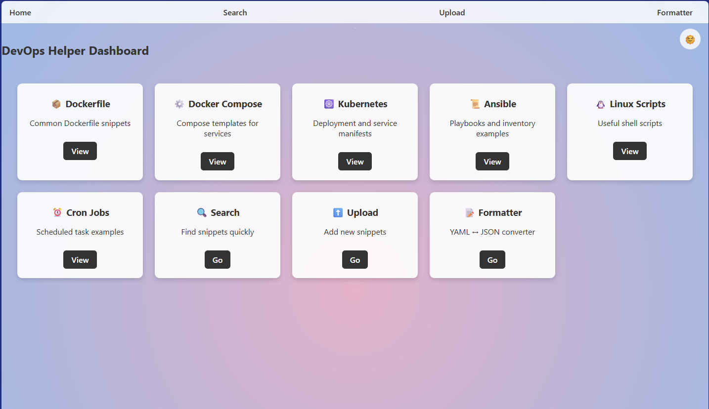
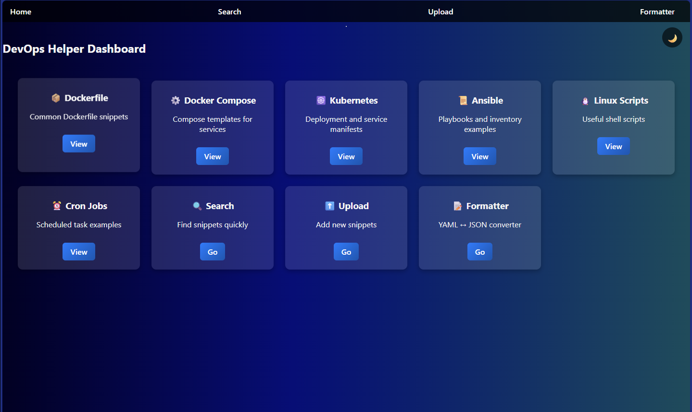
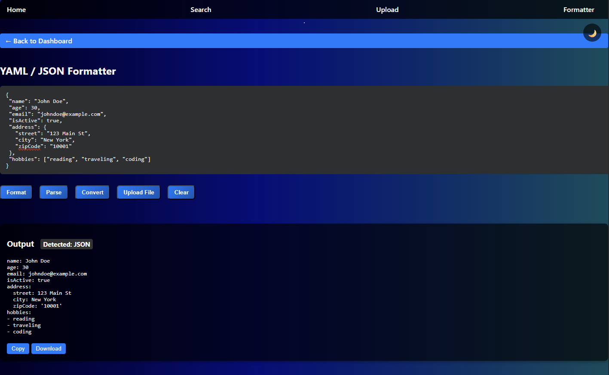

# 🚀 DevOps Helper

A modular Flask dashboard for DevOps engineers — search, upload, format, and manage infrastructure snippets with style.


---

## 🎨 Features

- 🧱 **Dockerfile Snippets** — common patterns for containerizing apps  
- 🧩 **Docker Compose** — service orchestration templates  
- ☸️ **Kubernetes** — deployment, service, ingress manifests  
- 🛠 **Ansible** — playbooks and inventory examples  
- 🐧 **Linux Scripts** — shell utilities and automation  
- ⏰ **Cron Jobs** — scheduled task examples  
- 🔍 **Search** — find snippets instantly  
- 📤 **Upload** — add your own templates  
- 🔁 **Formatter** — YAML ↔ JSON converter with live preview

---

## 🌈 Theme Toggle

Switch between **light** and **dark gradient themes** with a single click.

| Light Mode | Dark Mode |
|------------|-----------|
|  |  |

---

## 🧪 Formatter Tool

Convert and preview structured data with ease.



Supports:
- JSON → YAML
- YAML → JSON
- Copy, download, upload, and clear actions

---

## 📦 Tech Stack

- **Flask** + Jinja2  
- **Docker** + GitHub Actions  
- **Prism.js** for syntax highlighting  
- **Modular templates** + global JS wiring  
- **Responsive CSS** with gradient themes

---

## 🚀 Local Setup

```bash
git clone https://github.com/astle286/devops-helper.git
cd devops-helper
pip install -r requirements.txt
flask run
App runs at: http://localhost:5000

🔄 CI/CD with GitHub Actions
Automatically builds and pushes Docker image to GHCR:

yaml
ghcr.io/astle286/devops-helper:latest
Workflow file: .github/workflows/deploy.yml

📁 Folder Structure
Code
devops-helper/
├── .github/
│   └── workflows/
│       └── deploy.yml
├── snippets/
│   ├── ansible-inventory.ini
│   ├── ansible-playbook.yml
│   ├── cron-examples.txt
│   ├── docker-compose.yml
│   ├── dockerfile.txt
│   ├── k8s-deployment.yml
│   ├── k8s-pod.yml
│   ├── k8s-service.yml
│   └── linux-scripts.sh
├── static/
│   ├── favicon.ico
│   ├── script.js
│   └── style.css
├── templates/
│   ├── 404.html
│   ├── 500.html
│   ├── ansible.html
│   ├── base.html
│   ├── cron.html
│   ├── docker-compose.html
│   ├── dockerfile.html
│   ├── index.html
│   ├── kubernetes.html
│   ├── linux.html
│   ├── search.html
│   ├── upload_snippet.html
│   └── yaml_formatter.html
├── .gitignore
├── app.py
├── docker-compose.yaml
├── Dockerfile
├── README.md
├── redis.conf
└── requirements.txt
💡 Inspiration
Built for speed, clarity, and delight — DevOps Helper is your snippet sidekick.

🛡 License
MIT — feel free to fork, extend, and contribute.